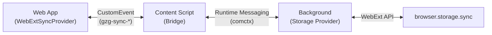

# GzG Tracker Extension (WXT)

This directory contains the source code for the GzG Tracker companion browser extension, built
with [WXT](https://wxt.dev/) and Vue 3.

## Overview

The extension serves two primary purposes:

1. **Direct Storage:** Providing a unified `browser.storage.sync` backend for the application when running inside the
   extension context (Popup or Full Tab).
2. **Bridge Sync:** Acting as a storage provider for the standalone website (e.g., running on localhost) by bridging
   calls from the page to the extension's background storage.

## Architecture

### Components

- **Background Script (`entrypoints/background.ts`):**
    - Hosts the `SyncStorageService` using [comctx](https://www.npmjs.com/package/comctx).
    - Directly interacts with `browser.storage.sync`.
- **Content Script (`entrypoints/content.ts`):**
    - Injected into specified origins (configured in `wxt.config.ts`).
    - Listens for `gzg-sync-request` CustomEvents from the web page.
    - Forwards requests to the Background Script via the `comctx` bridge.
    - Dispatches `gzg-sync-response` CustomEvents back to the web page.
- **Popup (`entrypoints/popup/`):**
    - Small UI that hosts the full GzG Tracker application.
    - Allows quick access to data and sync status.
- **Dashboard (`entrypoints/dashboard/`):**
    - Hosts the full GzG Tracker application in a dedicated browser tab.
    - Opened via the "Open in Full Tab" button within the app.

### Communication Flow (Bridge Mode)

## Development

### Build Commands

From the project root:

- `npm run wxt:dev`: Start WXT dev mode (defaults to Chrome).
- `npm run wxt:dev:firefox`: Start WXT dev mode for Firefox.
- `npm run wxt:build`: Build the extension for the default browser.
- `npm run wxt:build:firefox`: Build the extension for Firefox.

The build output is located in `extension/.output/`.

## Configuration

- **`wxt.config.ts`**: Main configuration for WXT, including permissions (`storage`), content script matching, and
  manifest overrides.
- **`utils/SyncStorageService.ts`**: Defines the shared sync interface and `comctx` proxy logic.
- **`utils/*Adapter.ts`**: Environment-specific adapters for `comctx` messaging.

