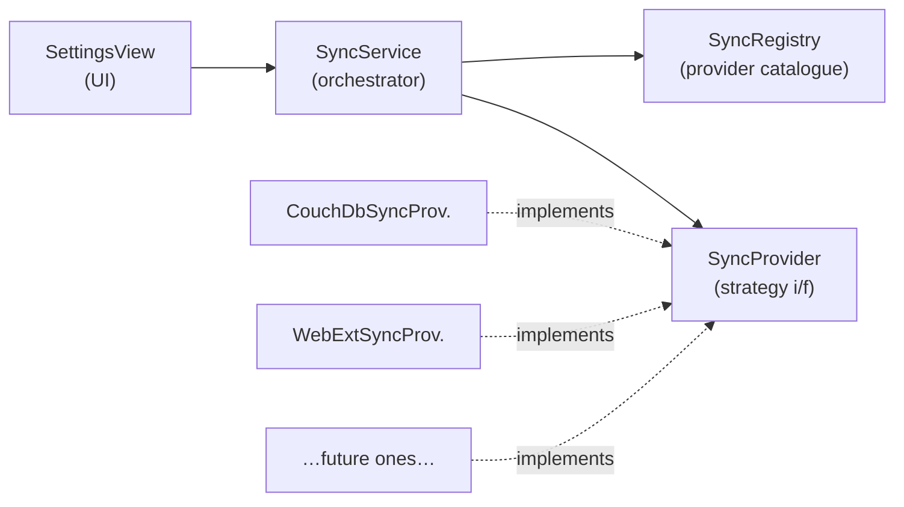
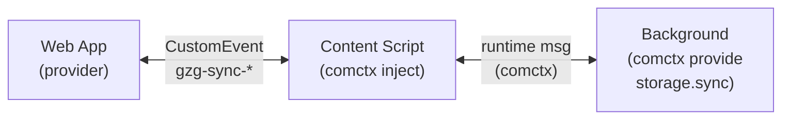

# Sync Architecture

## Overview

The sync subsystem allows GzGTracker data to be synchronised across devices via
pluggable **sync providers**. It follows the **Strategy pattern**: a common
`SyncProvider` interface defines the contract, and concrete implementations
handle the transport details for each backend (CouchDB, WebDAV, browser
extension, etc.).



## Key Components

### `SyncProvider` (interface — `SyncProvider.ts`)

The strategy interface every provider must implement:

| Member                              | Purpose                                                                         |
|-------------------------------------|---------------------------------------------------------------------------------|
| `name`                              | Human-readable label shown in the Settings UI                                   |
| `key`                               | Unique identifier used to persist the user's choice                             |
| `configFields`                      | Declares what credentials/settings the provider needs (rendered as form fields) |
| `testConnection(config)`            | Validates connectivity; resolves on success, rejects on failure                 |
| `pull<T>(storeName, config)`        | Fetches all items for a store from the remote                                   |
| `push<T>(storeName, items, config)` | Sends local items to the remote                                                 |

### `SyncRegistry` (`syncRegistry.ts`)

A simple catalogue of available providers. Providers self-register at module
load time:

```ts
syncRegistry.register(new CouchDbSyncProvider());
```

The Settings UI reads `syncRegistry.getAll()` to populate the provider
dropdown.

### `SyncService` (`syncService.ts`)

Orchestrates the actual sync. Responsibilities:

1. **Config persistence** — saves/loads the chosen provider key + credentials
   in a dedicated LocalForage instance (`gzg-sync-config`).
2. **Bidirectional merge** — for each store (`gzg-people`, `gzg-ibans`,
   `gzg-deals`, `gzg-submissions`):
    - Pulls remote items via the provider.
    - Merges with local items using **last-write-wins** on `updatedAt`.
    - Pushes items that are locally newer (or missing remotely) back up.

### `SettingsView.vue`

Renders the provider selector, dynamic config fields, and action buttons
(Save / Test Connection / Sync Now). All sync state is reactive via Vue refs.

## Data Model Assumptions

Every syncable record satisfies `SyncableRecord`:

```ts
interface SyncableRecord {
    id: string;        // UUID — stable across devices
    createdAt: string; // ISO 8601
    updatedAt: string; // ISO 8601 — used for conflict resolution
}
```

Conflict resolution is **last-write-wins** based on `updatedAt`. This is
simple and sufficient for a single-user / few-device scenario. Deletes are
currently **hard deletes** — a future improvement would be soft-delete
tombstones so deletions propagate during sync.

## Existing Providers

### CouchDB / PouchDB (`CouchDbSyncProvider.ts`)

⚠️ **UNTESTED**

Uses [PouchDB](https://pouchdb.com/) (browser build, lazy-loaded via dynamic
`import('pouchdb-browser')` to avoid bundling Node.js polyfills). PouchDB
handles the CouchDB replication protocol natively:

- `pull` → `localDb.replicate.from(remoteDb)` then reads all docs locally.
- `push` → upserts items into local PouchDB, then `localDb.replicate.to(remoteDb)`.

PouchDB is loaded lazily so it doesn't affect initial page load or cause
`events` polyfill errors in the browser.

**Config fields:** Server URL, Username, Password.

## Adding a New Sync Provider

1. Create `src/sync/MyProvider.ts` implementing `SyncProvider`.
2. Register it in `syncRegistry.ts`:
   ```ts
   import { MyProvider } from './MyProvider';
   syncRegistry.register(new MyProvider());
   ```
3. Export it from `src/sync/index.ts` if consumers need direct access.
4. That's it — the Settings UI picks it up automatically.

### Provider implementation checklist

- [ ] Implement all `SyncProvider` members (`name`, `key`, `configFields`,
  `testConnection`, `pull`, `push`).
- [ ] Use a unique `key` (used for config persistence).
- [ ] Declare all required config fields so the UI can render them.
- [ ] Handle authentication/authorisation in `testConnection`.
- [ ] Strip any transport-specific metadata before returning items from `pull`
  (e.g. PouchDB's `_id` / `_rev`).
- [ ] Be idempotent — `push` may be called with items that already exist
  remotely.

### WebExtension / Direct Storage (`InternalWebExtSyncProvider.ts`)

When the application is running **inside** a browser extension (e.g. as a popup), it can access `browser.storage.sync`
directly. This is the preferred method as it avoids the messaging overhead and works seamlessly within the extension.

The extension popup also provides an **"Open in Tab"** button that opens the full application in a normal browser tab
while still maintaining direct access to `browser.storage.sync`.

**Config fields:** None.

### WebExtension / Bridge Provider (`WebExtSyncProvider.ts`)

Used when the application is running as a **standalone website** but wants to sync via a companion extension. It uses
`CustomEvent` messaging to talk to the extension's content script.

**Architecture:**



- The **background script** provides a `SyncStorageService` via
  [comctx](https://www.npmjs.com/package/comctx) that wraps
  `browser.storage.sync` (get/set per store name).
- The **content script** injects into GzGTracker pages, creates a comctx proxy
  to the background service, and bridges calls from the page via `CustomEvent`
  (`gzg-sync-request` / `gzg-sync-response`).
- The **web app** (`WebExtSyncProvider`) dispatches `CustomEvent` messages and
  awaits responses — no browser extension APIs needed in page context.

**Config fields:** None (the extension is auto-detected via content script
injection).

**Limitations:** `browser.storage.sync` has an 8 KB per-key and 100 KB total
quota. Large datasets may require chunking in the future.

## Future Ideas

- **Nextcloud WebDAV provider** — store each store's data as a JSON file on
  Nextcloud via WebDAV; simple but poll-based, no real-time sync.
- **Etebase provider** — end-to-end encrypted sync via the Etebase protocol
  (EteSync v2).
- **Soft-delete tombstones** — so deletions propagate correctly during sync.
- **Selective sync** — allow users to choose which stores to sync.
